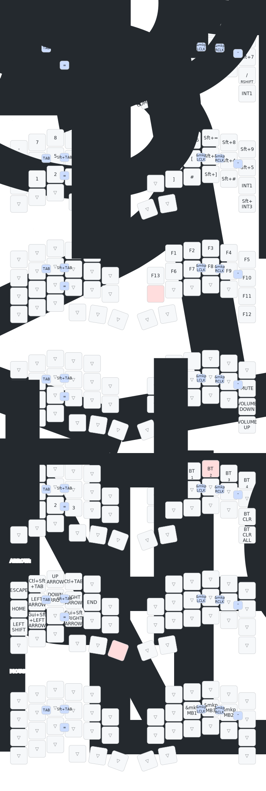

# zmk-config-roBa

roBa 用 ZMK キーマップの早見表です。  
設定のベースは [mozumasu/zmk-config-roBa](https://github.com/mozumasu/zmk-config-roBa) です。

以前のカスタムレイアウトはブランチ `backup/custom-layout-20260529` に保存しています。



図は `config/roBa.keymap` から [keymap-drawer](https://github.com/caksoylar/keymap-drawer) で生成しています。  
レイヤー名は **0 default → 1 NUM → 2 FUNCTION → 3 FN → 4 Bluetooth → 5 ARROW → 6 MOUSE** の順です（README の一覧表と同じ）。

---

## 覚え方のコツ（3つだけ）

| やりたいこと | 操作 |
|-------------|------|
| **記号・数字** | 左親指 **Space を押しっぱなし**（NUM レイヤー） |
| **英数 / かな** | 親指 **英数**・**かな** を**短く**タップ（長押しは別レイヤー） |
| **Fキー** | **`;` を押しっぱなし**（FUNCTION レイヤー） |

`trans`（透明）のキーは、そのレイヤーでは何も割り当てず **下のレイヤー（通常）のまま** 動きます。

---

## レイヤー一覧（`roBa.keymap` の並び順）

ZMK では **ファイルに書いた順** がレイヤー番号になります。`&lt N` の `N` はこの番号です。

| 番号 | キーマップ上の名前 | 入り方（default から） |
|------|-------------------|------------------------|
| 0 | `default_layer` | （通常） |
| 1 | `NUM` | **Space** ホールド（`&lt 1`） |
| 2 | `FUNCTION` | **`;`** ホールド（`&lt 2`） |
| 3 | `FN` | **かな** ホールド（`&lt 3`） |
| 4 | `Bluetooth` | **かな** ホールド中に **Q**（`&mo 4`） |
| 5 | `ARROW` | **英数** ホールド（`&lt 5`） |
| 6 | `MOUSE` | 直接の割当なし（下記参照） |

※ キーマップ先頭の `#define MOUSE 4` などは **レイヤー番号とは一致しません**（未使用の名前）。操作の目安は上表だけ見てください。

**MOUSE（6）** … default の `B` 右（内側）が左クリック。レイヤー 6 のキー配置は、別の方法で MOUSE に入ったとき用です。

---

## 親指キー（いちばんよく使う）

| キー（位置） | タップ | ホールド |
|-------------|--------|----------|
| **Space**（左内側） | スペース | **NUM**（数字・記号） |
| **英数**（左中央寄り） | 英数 | **ARROW**（矢印など） |
| **かな**（右内側） | かな | **FN**（音量・明るさ） |
| **`;`**（左手 N の右・内側） | `;` | **FUNCTION**（F1〜F12） |
| **Backspace**（Tab の右） | バックスペース | **Ctrl**（ホールド） |
| **Enter / ⌘**（右 Cmd の位置） | Enter | **Right Cmd**（ホールド） |

**Esc** が必要なときは **英数ホールド**（ARROW レイヤー）の左上にあります。

---

## 0. 通常レイヤー `default_layer`（何も押さないとき）

```
左手                          右手
┌───┬───┬───┬───┬───┐       ┌───┬───┬───┬───┬───┐
│ Q │ W │ E │ R │ T │       │ Y │ U │ I*│ O │ P │
├───┼───┼───┼───┼───┤       ├───┼───┼───┼───┼───┤
│ A │ S │ D │ F │ G │ ⌘⇧S │- │ H │ J │ K │ L │ ' │
├───┼───┼───┼───┼───┤       ├───┼───┼───┼───┼───┤
│⇧Z*│ X │ C │ V │ B │ 左クリ│;* │ N │ M │ , │ . │⇧/│
├───┼───┼───┼───┼───┤       ├───┼───┼───┼───┼───┤
│⌘ │⌥ │Tab│⌫* │Spc*│英数*│⌘*│かな*│           \ │
└───┴───┴───┴───┴───┘       └───┴───┴───────────┘

* Z     … タップ Z / ホールド Shift
* /     … タップ / / ホールド Shift
* ⌫     … タップ Backspace / ホールド Ctrl
* ⌘（右）… タップ Enter / ホールド Right Cmd
* Spc   … タップ Space / ホールド NUM
* 英数  … タップ 英数 / ホールド ARROW
* かな  … タップ かな / ホールド FN
* ;     … タップ ; / ホールド FUNCTION
* I     … `i`
```

### 通常レイヤーだけで打てる記号

| キー | 出力 |
|------|------|
| G の右（内側） | `-` |
| L の右 | `'` |
| M の右 | `,` `.` |
| `/`（タップ） | `/` |
| 右下 | `\` |

---

## 1. NUM レイヤー（Space ホールド = `&lt 1`）

**Space を押したまま** 下表のキーを押します。  
（Web の Keymap Editor では `JP_*` が表示されないことがありますが、実機では問題なく出ます。）

### 左手

| 位置 | キー | 出力 |
|------|------|------|
| 上段 | 左端 | `-` |
| 上段 | 続き | `7` `8` `9` |
| 上段 | 右端 | `+` |
| 中段 | 左端 | `/` |
| 中段 | 続き | `4` `5` `6` |
| 中段 | 右端 | `*` |
| 下段 | 続き | `1` `2` `3` |
| 下段 | | `.` |
| 下段 | 右 | `=` |
| 下段 | 左端（⇧付き） | `0`（Shift ホールド付き） |
| 親指列 | すべて | 下のレイヤー透過（通常キーのまま） |

### 右手（記号はここがメイン）

| 位置 | 出力 |
|------|------|
| 上段 左→右 | `Y`=`^` `U`=`&` `I`=`~` `O`=`(` `P`=`)` |
| 中段 左→右 | 内側 `_` → 指 `H`=`!` `J`=`@` `K`=`#` `L`=`$` `'`=`%` |
| 下段 左→右 | 内側 `` ` `` → 指 `M`=`[` `,`=`]` `.`=`{` `/`=`}` |
| 右下 | `¥`（通常）/ `\|`（NUM） |

### 記号クイック参照（Space + 右手）

```
        Y  U  I  O  P        … ^ & ~ ( )
   (_)  !  @  #  $  %     … (_) は内側キー、@ は J、# は K
  (`)  M  ,  .  /          … ` は ; キー（N の左・内側）、[ ] { } は M , . /
                    |      … ¥ は右下、| は Space ホールド + 右下
```

---

## その他のレイヤー

以下は **`roBa.keymap` に書いてある順** です。

### 2. FUNCTION（`;` ホールド = `&lt 2`）

| 右手 |
|------|
| F1〜F5（上段） |
| F6〜F10（中段） |
| F11（下段） |
| F12（右下） |
| F13（中段・内側） |

左手は `trans`（通常レイヤーのまま）。

### 3. FN（`かな` ホールド = `&lt 3`）

| 左手 | 右手 |
|------|------|
| **Q** … Bluetooth レイヤーへ（`&mo 4`、Q を押している間だけ） | 明るさ − / ＋ |
| **T** … ターミナル開閉（Cursor / VS Code 既定の Ctrl+`） | ミュート |
| | 音量 − / ＋ |

### 4. Bluetooth（**かな** ホールド → **Q** = `&mo 4`）

設定用レイヤーなので、通常タイピングでは入りません。**かな** を押したまま **Q** を押すと Bluetooth レイヤーが有効になります（Q を離すと FN に戻る）。

| 右手 |
|------|
| BT 0〜4 選択 |
| BT クリア / 全クリア |
| Bootloader（内側） |

### 5. ARROW（`英数` ホールド = `&lt 5`）

| 左手 | 出力 |
|------|------|
| 上段 | Esc / 前タブ / ↑ / 次タブ |
| 中段 | Home / ← / ↓ / → / End |
| 下段 | Shift + 選択範囲拡張（←→） |

エンコーダ … スクロール（default と同じ）

### 6. MOUSE

default から `mo` / `lt` では入りません。通常は **内側キーの左クリック**（`mkp LCLK`）を使います。  
レイヤー 6 を有効にしたときは、右手中段にマウスボタン（左・中・右）があります。

---

## コンボ（2キー同時・20ms 以内）

| 同時に押すキー | 出力 |
|---------------|------|
| **S + D** | Tab |
| **D + F** | Shift + Tab |
| **L + '**（L の右） | `"` |
| **C + V** | `=` |
| **O + P** | `)` |
| **J + K** | 左クリック |
| **K + L** | 右クリック |

---

## ロータリーエンコーダ

| レイヤー | 動作 |
|----------|------|
| 0 default / 5 ARROW | スクロール（上下） |
| 6 MOUSE | スクロール（上下） |

---

## よくある操作例

| やりたいこと | 操作 |
|-------------|------|
| `!` を打つ | Space ホールド + 右手中段（`!` の位置） |
| `(` | Space ホールド + 右手上段（`(` の位置） |
| `)` | **O + P** 同時、または Space ホールド + 右手上段（`)` の位置） |
| `@` | Space ホールド + 右手中段 |
| Tab | **S + D** 同時 |
| 英数にする | 親指 **英数** タップ |
| かなにする | 親指 **かな** タップ |
| F5 | **`;` ホールド** + 右手上段 |

---

## かな / 英数が効かないとき（macOS）

このリポジトリは macOS 向けに `config/config.conf` で NKRO 拡張を有効にしています。  
ファームを書き換えたあとは **Mac の Bluetooth 登録を削除してからペアリングし直す** と、かな・英数キーが認識されることがあります。

- タップ … かな / 英数（レイヤーには入らない）
- 長押し … 英数 = ARROW、かな = FN

## 右下の `¥` と `|`（macOS 日本語配列）

| 操作 | 出力 |
|------|------|
| **右下タップ**（通常レイヤー） | `¥` |
| **Space ホールド + 右下** | `\|` |

## ビルド・書き込み

1. `main` に push する  
2. GitHub Actions の Artifacts から UF2 を取得  
3. 左右それぞれに書き込む  
4. **（Bluetooth 利用時）Mac でキーボードを削除 → 再ペアリング**  

---

## ファイル

| ファイル | 内容 |
|----------|------|
| `config/roBa.keymap` | キーマップ本体 |
| `config/keymap_jp.h` | 日本語記号のエイリアス（`JP_*`） |
| `keymap-drawer/roBa.svg` | レイヤー図（自動生成） |
